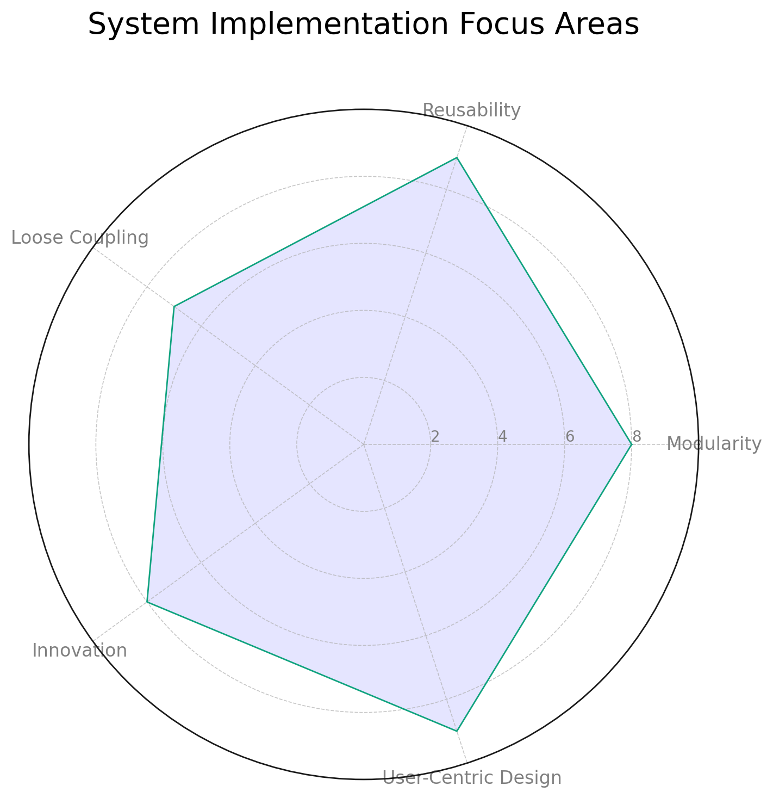

# Kind Health 

# Kind Health System Project

## Introduction

The Kind Health System project represents a cutting-edge endeavor to revolutionize patient care through the integration of Large Language Models (LLMs) within a multi-agent, modular architecture. This initiative seeks to bridge the gap in healthcare communication, leveraging the power of AI to provide enhanced support to healthcare practitioners and patients alike. Our approach prioritizes adaptability, modularity, and scalability, ensuring the system's capacity to evolve in line with technological advancements and the dynamic needs of the healthcare sector.

## About the Paper

Our accompanying paper delves into the theoretical underpinnings and practical applications of the Kind Health System. It outlines the strategic deployment of autonomous agents, each tasked with specific functions, ranging from data processing and medical knowledge management to user interaction and system evaluation. The paper also explores the crucial role of tracing mechanisms in maintaining system transparency and accountability, essential for fostering trust among users.

*Figure: An illustrative diagram of the System Framework Focus Areas, showcasing the multifaceted approach to system assessment and improvement.*

## Open to Contributions

As a work in progress, the Kind Health System project warmly welcomes contributions from the community. We are especially interested in collaborations that can enhance the system's functionality, user interface design, and evaluation mechanisms. Whether your expertise lies in AI, healthcare informatics, user experience design, or any other relevant field, your insights and contributions can play a pivotal role in shaping the future of healthcare.

### How to Contribute

1. **Fork the Repository**: Start by forking the project's repository to your GitHub account.
2. **Explore the Issues**: Check out the current issues for areas where you can contribute. Feel free to open a new issue if you have a suggestion or identify a bug.
3. **Submit Pull Requests**: After making your changes, submit a pull request (PR) against the main branch. Please provide a clear description of your contributions and any relevant details that can assist in the review process.
4. **Engage in Discussions**: Join the conversation by participating in discussions related to your PRs or issues. Your feedback and insights are invaluable to the project's success.

## Stay Connected

We encourage all contributors and interested parties to stay engaged with the project. Regular updates, discussions, and collaboration opportunities will be posted to ensure an inclusive and transparent development process.

For more information, queries, or to join our community, please reach out through [GitHub Discussions](https://github.com/Kind-Gestures-Tech/discussions) or our project's [Telegram channel](https://t.me/+NKH_AaLyUhIyNzdl).

Together, we can redefine the intersection of healthcare and technology, creating a more connected, efficient, and empathetic healthcare ecosystem.

## Author's

Saransh Sharma 
Joy Akisaniya
Anirudh 
Johnson Chetty
